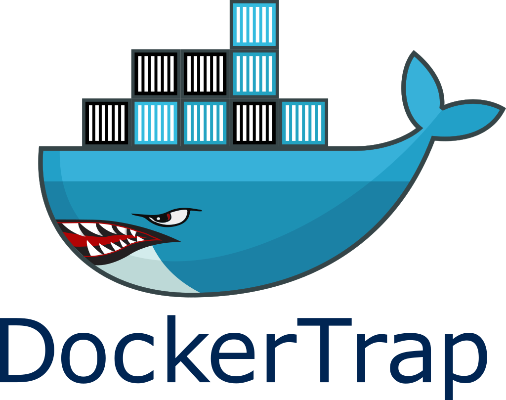
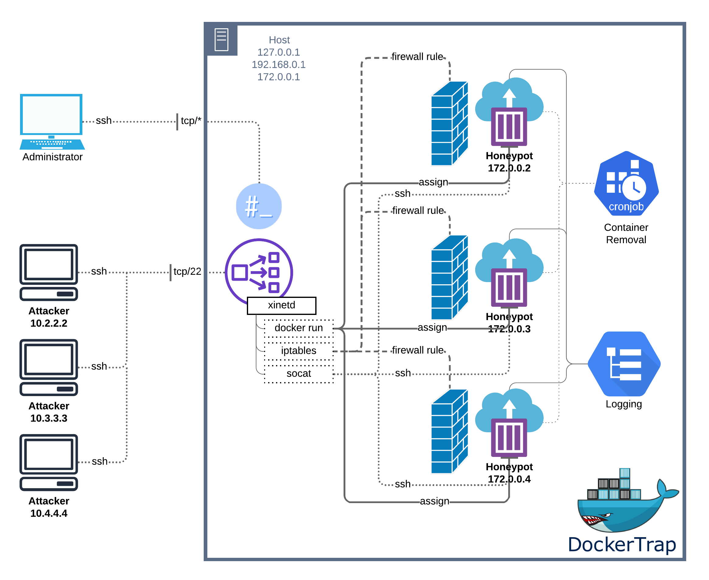

# DockerTrap

	

## TL;DR

DockerTrap is Docker based honeypot that creates new, isolated, firewalled containers for each IP address that tries to connect to the host. Any Docker image can now be used as a honeypot! No restrictions!

## System Design

	

## Installation for Ubuntu 18.04 LTS

### Install the necessary software

Install [Docker](https://docs.docker.com/v17.09/engine/installation/linux/docker-ce/ubuntu/)

~~~ shell
sudo apt-get update
sudo apt-get install docker.io socat xinetd auditd
~~~

### Install the honeypot scripts 

Copy `honeypot` to `/usr/bin/honeypot` and `honeypot.clean` to
`/usr/bin/honeypot.clean` and make them executable. You may have to
customize the ports in the iptables rules, the memory limit of the
container and the network quota if you want to run anything other than
an SSH honeypot on port `22`.

### Configure crond, xinetd and auditd

#### crond

Add the following line to `/etc/crontab`. This runs the cleanup script
to check for old containers every 5 minutes.

~~~ shell
*/5 * * * * /usr/bin/honeypot.clean
~~~

#### xinetd

Create the following service file in `/etc/xinetd.d/honeypot` and add
the line `honeypot 22/tcp` to `/etc/services` to keep xinetd happy.

~~~ shell
# Container launcher for an SSH honeypot
service honeypot
{
        disable         = no
        instances       = UNLIMITED
        server          = /usr/bin/honeypot
        socket_type     = stream
        protocol        = tcp
        port            = 22
        user            = root
        wait            = no
        log_type        = SYSLOG authpriv info
        log_on_success  = HOST PID
        log_on_failure  = HOST
}
~~~

#### auditd

Enable logging the execve systemcall in auditd by adding the following audit rules:

~~~ shell
auditctl -a exit,always -F arch=b64 -S execve
auditctl -a exit,always -F arch=b32 -S execve
~~~

### Create a base image for the honeypot

A Dockerfile for a base image is included in the `alpinetrap` directory and sets to root password to `root` by default. You can create and configure your own base image without restriction. The container will spin up and be managed by xinitd normally. Any initialization is up to you.

### Final install notes

Make sure to commit the image as "`honeypot:latest`". You may also wish to create additional accounts named `user`, `guest`, `admin`, `temp`, etc., and give them weak passwords like `1234`, or `password` to let brute-force attackers crack your host easily. The IP address of the attacker's host is passed to the container in the environment variable `REMOTE_HOST`. For logging, you may want to configure an rsyslog instance to forward logs to the host machine.

## TODO

1. Firewall rules are bugged and more restrictive than intended
2. Logging with auditd is still bugged and not working as intended
3. Docker API honeypot `apitrap.sh` will be replaced by something like [Whaler](https://github.com/oncyberblog/whaler) (redirected from a secured host, possibily on a per-instanced basis like DockerTrap); but should appear as an unsecured host to each honeypot.
4. Auto install still needed

## Attribution

Thanks goes to [Peter Kasza](https://github.com/mrschyte) for the origional [Dockerpot](https://github.com/mrschyte/dockerpot); brilliant work!
